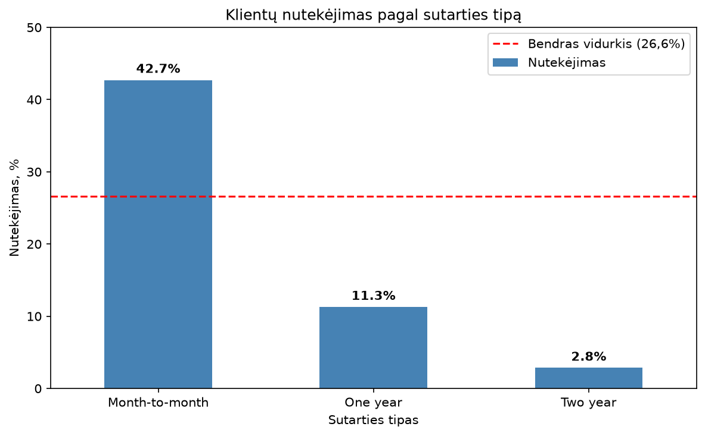
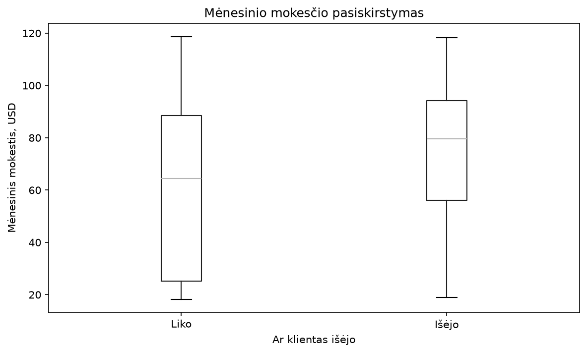
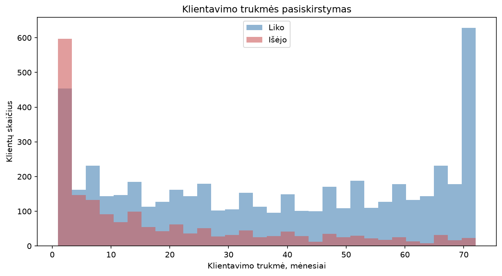
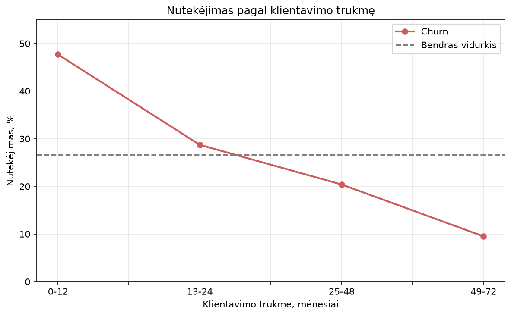

# Telco Customer Churn Analysis

Customer churn analysis of a telecom company using Python (pandas, SciPy, matplotlib): who leaves, when, and what the data says about how to keep them.

> **Note:** the notebook commentary and chart labels are written in Lithuanian. The summary below is in English.

## Business question

Winning a new customer costs several times more than keeping an existing one. If a telecom operator can tell early which customers are likely to leave, it can step in with an offer before they cancel.

**Which customers churn, when do they churn, and which factors are most closely linked to it?**

## Data

- IBM Telco Customer Churn sample dataset (available on Kaggle): 7,043 customers, 21 columns.
- Each row is one customer: contract type, monthly charges, tenure, internet service, payment method, and whether the customer churned.
- **Cleaning:** `TotalCharges` was loaded as text because 11 rows contained a blank instead of a number. All 11 customers had `tenure = 0` (new customers who had not yet been billed) and none had churned, so the rows were removed (0.16% of the data). **7,032 customers** remain.
- **Overall churn rate: 26.6%** (1,869 of 7,032).

## Methods

- **Python** (pandas, matplotlib, SciPy) in a Jupyter notebook
- **Chi-square test** to compare two categorical variables (contract type vs. churn)
- **Welch's t-test** to compare a numeric variable between churned and retained customers (monthly charges, tenure)
- **`pd.cut`** to group tenure into bands and see the trend rather than just two averages

Each hypothesis is reported with a p-value to check that the difference is not just random variation.

## Key findings

| # | Hypothesis | Result |
|---|-----------|--------|
| H1 | Shorter contracts lead to higher churn | **Confirmed.** Month-to-month 42.7%, one-year 11.3%, two-year 2.8% (χ² = 1179.6, p < 0.001) |
| H2 | Churned customers paid more per month | **Confirmed, but price is probably not the cause.** $74.44 vs. $61.31 (t = 18.3, p < 0.001) |
| H3 | New customers churn the most | **Confirmed, and it is the strongest effect.** 47.7% churn in the first 12 months vs. 9.5% after 49+ months |

### H1: Contract type



Month-to-month customers churn about 15 times more often than two-year customers. Caveat: the data cannot say which way this works. A long contract may keep people, or loyal customers may simply choose long contracts.

### H2: Monthly charges



Churned customers paid about $13 more per month. However, fiber optic customers pay the most ($91.50 on average) and churn the most (41.9%), while customers without internet pay about $21 and rarely churn (7.4%). The link looks driven by **service type**, not price itself.

### H3: Tenure





The median churned customer had been with the company for only 10 months (vs. 38 months for retained customers). Churn falls steadily with tenure: 47.7% → 28.7% → 20.4% → 9.5%.

### Extra insight: payment method

Customers paying by electronic check churn at 45.3%, versus 15-19% for all other methods. Electronic check users are mostly month-to-month customers (78.2%), so this could just be the contract effect. Checking **within month-to-month customers only**, electronic check still shows 53.7% churn against roughly 32-34% for the other methods, so payment method matters on its own.

## Conclusions and recommendation

The three strongest risk signals are a **month-to-month contract**, a **new customer (0-12 months)**, and **payment by electronic check**. The typical at-risk customer is new, on a monthly contract, and on a more expensive fiber optic plan.

**Recommendation:** monitor customers with this profile closely during their first 3 months, and offer a longer contract or automatic payment.

## Limitations

- The results show associations, not causes.
- The analysis is descriptive. It does not build a predictive model, and the risk factors were examined one at a time rather than together.
- The dataset is a sample dataset with no dates, so trends over calendar time cannot be studied.

## Repository structure

```
telco-customer-churn-analysis/
├── README.md
├── telco_churn_analysis.ipynb          # full analysis with commentary
├── WA_Fn-UseC_-Telco-Customer-Churn.csv  # dataset
└── images/                             # charts used in this README
```

## How to run

```bash
pip install pandas matplotlib scipy jupyter
jupyter notebook telco_churn_analysis.ipynb
```

Run the notebook from the repository folder so it can find the CSV file.

## Author

**Tajus Davidavičius**, Data Analytics and Python Programming course, Vilnius Coding School, 2026
